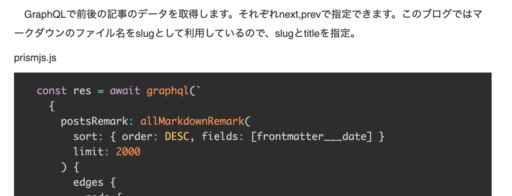

## 目標
以下のようにブログポストに参考コードを入れたい時にわかりやすい様にテーマを適応したい。

```javascript:title=test.js
const test = ()=>{
return true
}
```

今回は[prismjs](https://prismjs.com/)というJavascriptのライブラリのGatsbyプラグインを用いて実装する。


## 必要なプラグインのインストール
- [gatsby-remark-prismjs](https://www.gatsbyjs.com/plugins/gatsby-remark-prismjs/)

コードにシンタックスハイライトを適用する。

- [gatsby-remark-code-titles](https://www.gatsbyjs.com/plugins/gatsby-remark-code-titles/?=prism%20title)

ハイライトにタイトルをつけるプラグイン

まずはパッケージをターミナルからインストールする。
```shell:title=terminal
$ npm install prismjs gatsby-remark-prismjs gatsby-remark-code-titles
```


### gatsby-configの設定

インストールしたら、gatsby-config.jsにプラグインの情報を追加する。マークダウンで記事を管理している場合はgatsby-transformer-remarkが導入されているはずなので、それのoptionとしてインストールした2つのプラグインを追加する。

```javascript{6,7}:title=gatsby-config.js
//...中略
{
      resolve: "gatsby-transformer-remark",
      options: {
        plugins: [
          "gatsby-remark-code-titles",
          "gatsby-remark-prismjs",
          {
//...中略
```
この時、gatsby-remark-code-titleはgatsby-remark-prismjsより先に記入する必要がある。
Prismjsは様々なテーマを提供していて、公式サイトで確認することができる。

### テーマの適用

``` javascript:title=blog-template.js
import "prismjs/themes/prism-tomorrow.css"
```

以上で導入は完了。しかしこの状態はあまり美しくないのでCSSを少し修正する必要がある。


<br>
<br>


*どれが本文でどれがファイル名か見分けがつかない。*


<br>
<br>


### スタイルを追加
素の状態だとあまりにも素っ気ないので、CSSを追加した。
最初はブログテンプレートのCSSに記入したが、適応されず。
どうやらグローバルスタイルに記入しないといけない模様。

``` css:title=global.css
.gatsby-code-title {
  background: #5555;
  color: #ffffff;
  margin-bottom: -1rem;
  padding: 1rem;
  font-size: 0.9rem;
  line-height: 0.3;
  font-weight: 800;
  border-radius: 5px 5px 0 0;
  display: table;
}
```

コードのタイトルのスタイルは`gatsby-code-title`クラスで、
Prismjsのスタイルは`gatsby-highlight`クラスでそれぞれ指定することができる。

## まとめ

シンタックスハイライト無しでのコードは読めたものでは無いので、このブログにとっては必須のプラグインだ。
導入も簡単なのでおすすめです。

では。