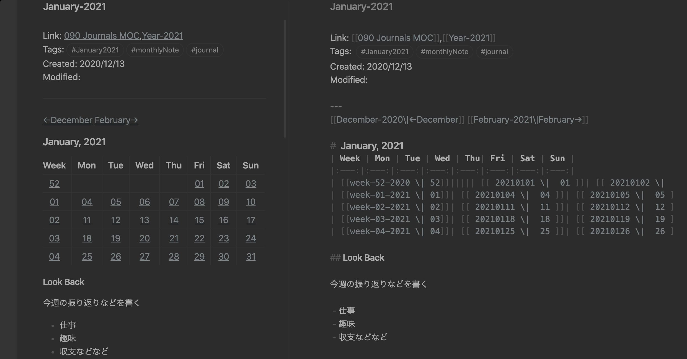
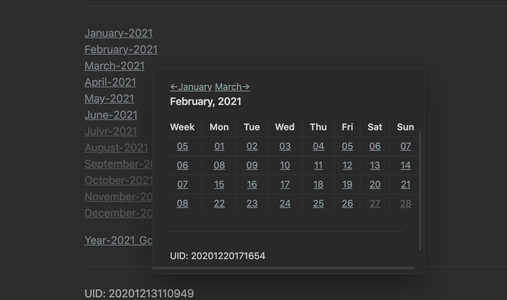

## ねらい




こんな感じで、[Obsidian](Obsidian.md)で日記を管理するためにマークダウンリンクのついたカレンダーを作成したい。しかし手動で一年分のカレンダーを作成するのは流石に骨が折れます。[Obsidianの公式フォーラム](https://forum.obsidian.md/t/calendar-and-tasks-for-daily-notes/3218/4)でマークダウンカレンダーを自動生成する便利なシェルスクリプトを見つけたので紹介したいと思います。


## スクリプトを書き換える
[こちらのスクリプト](https://gist.github.com/chrxn/6f133e283f3a7587231728fd240bc289)をダウンロードして、エディタで開きます。

*僕はこのスクリプトの作者ではありません。

### 期間を指定する

コードの始めあたりにカレンダーで生成したい期間を指定できる項目があるので、それを書き換えましょう。

```sh:title=md-cal.sh
startdate=2021-01-01
enddate=2021-12-31
```

今回は一年分作成します。

### フォーマットを指定する

僕はObsidianコアプラグインの一つである"Daily notes"を使って毎日のノートを作成しています。そのプラグインが作成するファイル名のフォーマットと一致するように、シェルスクリプトを書き換えます。

このシェルスクリプトのデフォルトのフォーマットは`%Y-%b-%d-%a`ですので、`2021-02-26`というファイルが作成されす。もしその通りのフォーマットでdaily noteを管理しているのなら良いのですが、僕はファイル名を`YYYYMMDD`(例:20210226)となるように設定していますので、この項目を以下のように編集しました。


```sh:title=md-cal.sh
linkformat="%Y%b%d%a"
displayformat="%d"
```

他にもカレンダーの空白の日付をどのように埋めるかなど、細かい部分を設定できます。

## スクリプトを走らせる

設定が完了したらスクリプトを走らせます。

```bash
bash md-cal.sh
```

`md-cal.sh`と同じディレクトリに`calendar.md`ファイルが生成されます。


```md:calendar.md
#  January, 2020
| Week | Mon | Tue | Wed | Thu| Fri | Sat | Sun |
|:---:|:---:|:---:|:---:|:---:|:---:|:---:|:---:|
| 00||| [[ 2020Jan01Wed \|  01 ]]| [[ 2020Jan02Thu \|  02 ]]| [[ 2020Jan03Fri \|  03 ]]| [[ 2020Jan04Sat \|  04 ]]| [[ 2020Jan05Sun \|  05 ]]|
| 01| [[ 2020Jan06Mon \|  06 ]]| [[ 2020Jan07Tue \|  07 ]]| [[ 2020Jan08Wed \|  08 ]]| [[ 2020Jan09Thu \|  09 ]]| [[ 2020Jan10Fri \|  10 ]]| [[ 2020Jan11Sat \|  11 ]]| [[ 2020Jan12Sun \|  12 ]]|
| 02| [[ 2020Jan13Mon \|  13 ]]| [[ 2020Jan14Tue \|  14 ]]| [[ 2020Jan15Wed \|  15 ]]| [[ 2020Jan16Thu \|  16 ]]| [[ 2020Jan17Fri \|  17 ]]| [[ 2020Jan18Sat \|  18 ]]| [[ 2020Jan19Sun \|  19 ]]|
| 03| [[ 2020Jan20Mon \|  20 ]]| [[ 2020Jan21Tue \|  21 ]]| [[ 2020Jan22Wed \|  22 ]]| [[ 2020Jan23Thu \|  23 ]]| [[ 2020Jan24Fri \|  24 ]]| [[ 2020Jan25Sat \|  25 ]]| [[ 2020Jan26Sun \|  26 ]]|
| 04| [[ 2020Jan27Mon \|  27 ]]| [[ 2020Jan28Tue \|  28 ]]| [[ 2020Jan29Wed \|  29 ]]| [[ 2020Jan30Thu \|  30 ]]| [[ 2020Jan31Fri \|  31 ]]|||  

```


あとは、これをObsidianのvaultにコピペするだけです。


僕は月ごとにノートを作成して、それらをひっくるめて年ごとのノートにつなげています。このカレンダーのおかげで日記の読み返しが楽しくなりました。

## まとめ

他にも[コミュニティプラグインのカレンダー](https://github.com/liamcain/obsidian-calendar-plugin)を使うという手もあると思います。Obisdianは開発チーム・コミュニティ共に最高ですね。

## 参考
[How To Format Date For Display or Use In a Shell Script](https://www.cyberciti.biz/faq/linux-unix-formatting-dates-for-display/)