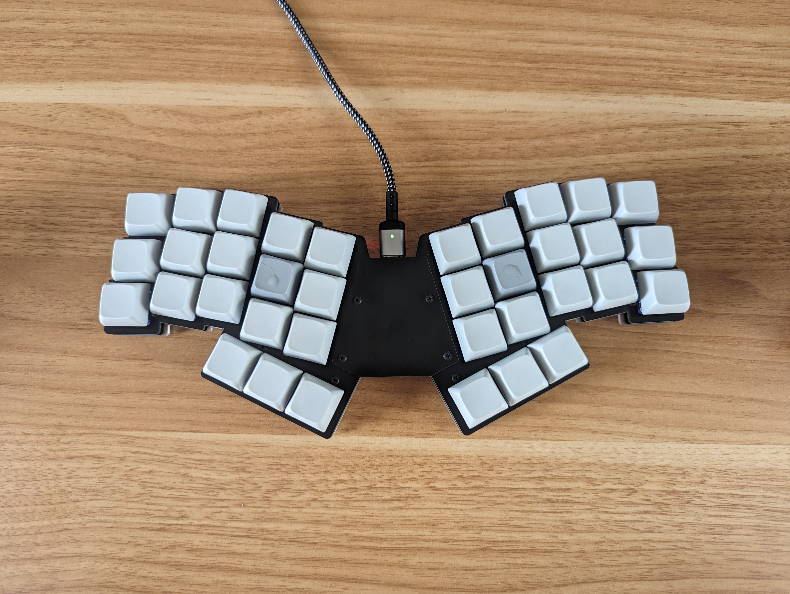

## Main
[nowt36](https://github.com/tamago324/nowt36)を購入して組み立てた。

初めて40以下の数のキーボードを使うことになって、キーマップを改めて考え直している。初めて68から46のキーボードを使用し始めた時も同じことに頭を悩ました記憶がある。今となれば普通のサイズのキーボードを使うなんて無理な気もする。

組み立ててからまだ1日しか使っていないが、現時点での感想としてとにかく指を全く動かさなくて良いので楽だということ。一体型だが分割風味な感じと、配列もドンピシャな印象。見た目がかっこいいと思って購入したのだが、見た目以上に「コンパクトな」使用感で素晴らしい。

現在は以下のようなレイアウトで運用している。

やはり`alt`, `tab`, `ctr`などを占有キーに配列させることができなくなったのは大きな問題だ。右手でShiftを押すのにも慣れない。

しかしこの「慣れない」というのも新しいキーボードを買ってから暫くしか続かない感情だ。この気持ちを味わい続けてみたいと思う。

自作キーボードもこれで４台目だ。次はキーボードだけではなく、エルゴノミクス全般の工夫について書いてみたい。